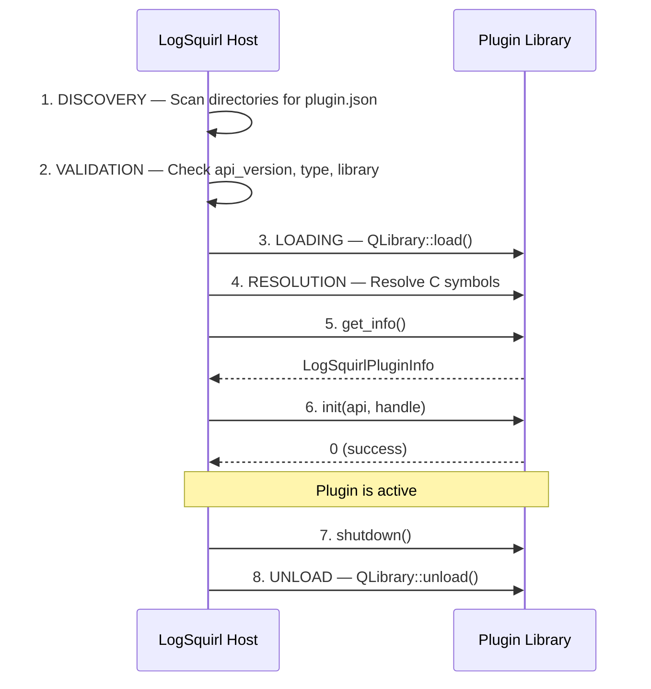
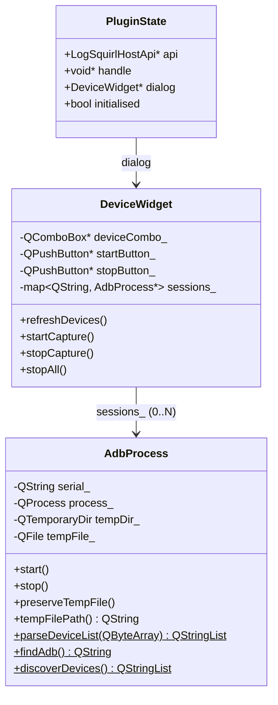

# Developer Guide — Writing LogSquirl Plugins

This guide explains the LogSquirl Plugin SDK by walking through the
logsquirl-logcat source code.  Use this as a reference when building
your own plugins.

---

## Table of Contents

1. [Plugin Lifecycle Overview](#1-plugin-lifecycle-overview)
2. [The Plugin Manifest — plugin.json](#2-the-plugin-manifest--pluginjson)
3. [The SDK Header — logsquirl\_plugin\_api.h](#3-the-sdk-header--logsquirl_plugin_apih)
4. [Entry Points — plugin.cpp](#4-entry-points--plugincpp)
5. [Host API Reference](#5-host-api-reference)
6. [Building a UI Plugin](#6-building-a-ui-plugin)
7. [Building a DataSource Plugin](#7-building-a-datasource-plugin)
8. [CMake Setup](#8-cmake-setup)
9. [Cross-Platform Considerations](#9-cross-platform-considerations)
10. [Debugging Tips](#10-debugging-tips)
11. [Checklist: New Plugin from Scratch](#11-checklist-new-plugin-from-scratch)

---

## 1. Plugin Lifecycle Overview

LogSquirl discovers and loads plugins in this order:



**Key rule:** All 4 entry points use the **C ABI** (`extern "C"`).  This
ensures there is no C++ name mangling, making plugins binary-compatible
regardless of compiler version.

---

## 2. The Plugin Manifest — plugin.json

Every plugin must include a `plugin.json` file in its install directory.

```json
{
    "id": "io.github.logsquirl.logcat",
    "name": "Android Logcat",
    "version": "0.1.0",
    "api_version": 1,
    "type": "ui",
    "library": "logsquirl_logcat",
    "description": "Stream Android logcat output from ADB devices into LogSquirl tabs",
    "author": "LogSquirl Contributors",
    "license": "GPL-3.0-or-later"
}
```

### Field Reference

| Field         | Required | Description |
|---------------|----------|-------------|
| `id`          | Yes      | Reverse-DNS identifier, globally unique. |
| `name`        | Yes      | Human-readable name shown in the Manage Plugins dialog. |
| `version`     | Yes      | Semantic version string. |
| `api_version` | Yes      | Must be `1`. LogSquirl rejects plugins with unknown API versions. |
| `type`        | Yes      | `"ui"` or `"datasource"` — determines plugin behaviour. |
| `library`     | Yes      | Shared library name **without extension**. QLibrary appends the platform suffix automatically (`.dylib`, `.so`, `.dll`). |
| `description` | No       | Short description shown in the plugin list. |
| `author`      | No       | Author or organisation name. |
| `license`     | No       | SPDX license identifier. |
| `url`         | No       | Homepage or repository URL. |

### Plugin Types

- **`ui`** (value `2` / `LOGSQUIRL_PLUGIN_UI`): The plugin registers a menu
  action via `register_menu_action()` and/or a status bar widget.  It can call
  any Host API function (open files, show notifications, etc.).

- **`datasource`** (value `0` / `LOGSQUIRL_PLUGIN_DATASOURCE`): The plugin
  pushes log lines via `push_line()` / `push_lines()`.  **Limitation:** only
  one active stream per plugin at a time.  Use `ui` type if you need multiple
  streams.

---

## 3. The SDK Header — logsquirl_plugin_api.h

The vendored SDK header (`include/logsquirl_plugin_api.h`) defines:

### LogSquirlPluginInfo

```c
typedef struct {
    const char* id;
    const char* name;
    const char* version;
    const char* description;
    const char* author;
    const char* license;
    int         type;          // LOGSQUIRL_PLUGIN_DATASOURCE / _CONVERTER / _UI
    int         api_version;   // Must be LOGSQUIRL_PLUGIN_API_VERSION (1)
} LogSquirlPluginInfo;
```

This struct is returned by `get_info()`.  The host uses it to cross-validate
against `plugin.json` and to display plugin metadata in the Manage Plugins
dialog.

### LogSquirlHostApi

The host API is a function-pointer table supplied to `init()`.  Key callbacks:

| Function | Purpose |
|----------|---------|
| `log_message()` | Write to the host log |
| `open_file()` | Open a file in a new LogSquirl tab |
| `show_notification()` | Show a transient status bar message |
| `get_config_dir()` | Plugin-private configuration directory |
| `register_menu_action()` | Add an entry to the host menu bar |
| `register_status_widget()` | Embed a QWidget in the status bar |
| `push_line()` / `push_lines()` | Push lines (DataSource plugins) |

**Important:** Always pass the `handle` received in `init()` as the first
argument to every API call.  The host uses this handle to identify which
plugin is making the call.

### Export Macros

```c
#ifdef _WIN32
#  define LOGSQUIRL_PLUGIN_EXPORT __declspec(dllexport)
#else
#  define LOGSQUIRL_PLUGIN_EXPORT __attribute__((visibility("default")))
#endif
```

With `-fvisibility=hidden` in CMake, only functions explicitly marked with
`LOGSQUIRL_PLUGIN_EXPORT` are visible in the shared library.

---

## 4. Entry Points — plugin.cpp

These are the 4 C functions that LogSquirl resolves from your shared library.
They must be `extern "C"` and marked with `LOGSQUIRL_PLUGIN_EXPORT`.

### 4.1 get_info()

```cpp
LOGSQUIRL_PLUGIN_EXPORT const LogSquirlPluginInfo* logsquirl_plugin_get_info( void )
{
    static const LogSquirlPluginInfo kPluginInfo = {
        "io.github.logsquirl.logcat",
        "Android Logcat",
        "0.1.0",
        "Stream Android logcat from ADB devices into LogSquirl tabs",
        "LogSquirl Contributors",
        "GPL-3.0-or-later",
        LOGSQUIRL_PLUGIN_UI,
        LOGSQUIRL_PLUGIN_API_VERSION,
    };
    return &kPluginInfo;
}
```

**Called:** Once, right after the library is loaded.

**Do:** Return a pointer to a static struct with your plugin's metadata.

**Don't:** Allocate memory, create Qt objects, or call the host API.

### 4.2 init()

```cpp
LOGSQUIRL_PLUGIN_EXPORT int logsquirl_plugin_init(
    const LogSquirlHostApi* api, void* handle )
{
    g_state.api    = api;
    g_state.handle = handle;

    api->log_message( handle, LOGSQUIRL_LOG_INFO, "Logcat plugin initialising…" );

    // Register a menu action — opens the logcat session dialog
    api->register_menu_action( handle, "Plugins", "Android Logcat…",
                               &showLogcatDialog, nullptr );

    g_state.initialised = true;
    return 0;
}
```

**Called:** Once, after `get_info()`, when the plugin is enabled.

**Do:**
- Store the `api` pointer and `handle`.
- Register menu actions or status widgets.
- Return 0 on success, non-zero on failure.

**Don't:** Block for a long time (delays application startup).

### 4.3 shutdown()

```cpp
LOGSQUIRL_PLUGIN_EXPORT void logsquirl_plugin_shutdown( void )
{
    if ( g_state.dialog ) {
        g_state.dialog->stopAll();
        delete g_state.dialog;
        g_state.dialog = nullptr;
    }
    g_state.api = nullptr;
    g_state.handle = nullptr;
    g_state.initialised = false;
}
```

**Called:** Once, when the application exits or the plugin is disabled.

**Do:** Release all resources: stop processes, close files, delete Qt objects.

**Don't:** Call `exit()`, throw exceptions, or deadlock.

### 4.4 configure()

```cpp
LOGSQUIRL_PLUGIN_EXPORT void logsquirl_plugin_configure( void* parent_widget )
{
    auto* parent = static_cast<QWidget*>( parent_widget );
    // Show a dialog to configure the ADB path
    // ...
}
```

**Called:** When the user clicks "Configure" in the Manage Plugins dialog.

---

## 5. Host API Reference

All calls require the stored `api` pointer and `handle`.

### log_message()

```cpp
api->log_message( handle, LOGSQUIRL_LOG_INFO, "message" );
```

Log levels: `TRACE=0`, `DEBUG=1`, `INFO=2`, `WARNING=3`, `ERROR=4`, `CRITICAL=5`.

### open_file()

```cpp
api->open_file( handle, "/path/to/file.log", 1 );
```

Opens the file in a new LogSquirl tab.  Pass `follow=1` for tail mode.

**This is the key function for the logcat plugin** — each ADB device writes
to its own temp file, and `open_file()` makes LogSquirl tail it.

### show_notification()

```cpp
api->show_notification( handle, "Capture started for emulator-5554" );
```

### register_menu_action()

```cpp
api->register_menu_action( handle, "Plugins", "My Action…",
                           &myCallback, userData );
```

Adds a menu item under the specified menu path.  When clicked, `myCallback`
is invoked with `userData`.  This is how the logcat plugin adds
"Android Logcat…" to the Plugins menu.

### register_status_widget() / unregister_status_widget()

```cpp
api->register_status_widget( handle, static_cast<void*>( myWidget ) );
api->unregister_status_widget( handle, static_cast<void*>( myWidget ) );
```

Embed / remove a QWidget in the host's status bar area.

### get_config_dir()

```cpp
const char* dir = api->get_config_dir( handle );
```

Returns the plugin-private configuration directory. The host creates the
directory if it does not exist.

---

## 6. Building a UI Plugin

A UI plugin registers a menu action (and optionally a status bar widget) and
interacts with LogSquirl through the Host API.  This is the pattern used by
logsquirl-logcat.

### Class Diagram



### When to use a UI plugin

- You need a dialog or control panel in the UI
- You want to open multiple files / tabs programmatically
- You manage external processes and need UI controls
- The DataSource 1-stream limitation is too restrictive

### Step-by-step

1. Set `"type": "ui"` in `plugin.json`
2. In `init()`, call `register_menu_action()` to add a menu entry
3. In the callback, create and show your QDialog
4. Use `open_file()` to open files in LogSquirl tabs
5. In `shutdown()`, clean up all resources

---

## 7. Building a DataSource Plugin

A DataSource plugin provides a streaming data source.

### When to use a DataSource plugin

- You have a single data stream to push
- You don't need a persistent UI
- You want simple integration

### Step-by-step

1. Set `"type": "datasource"` in `plugin.json`
2. Push data with `push_line()` or `push_lines()`
3. Signal end-of-stream with `signal_eos()`

### Limitation

Only **one active stream** per DataSource plugin at a time.  If you need
multiple parallel streams, use a UI plugin with `open_file()` instead.

---

## 8. CMake Setup

Here's a minimal `CMakeLists.txt` for a LogSquirl plugin:

```cmake
cmake_minimum_required(VERSION 3.16)
project(my_plugin LANGUAGES CXX)

set(CMAKE_CXX_STANDARD 17)
set(CMAKE_CXX_STANDARD_REQUIRED ON)

find_package(Qt6 REQUIRED COMPONENTS Core Widgets)
qt_standard_project_setup()

add_library(my_plugin SHARED src/plugin.cpp)

set_target_properties(my_plugin PROPERTIES
    AUTOMOC ON
    POSITION_INDEPENDENT_CODE ON
)

if(NOT WIN32)
    target_compile_options(my_plugin PRIVATE -fvisibility=hidden)
endif()

target_include_directories(my_plugin PRIVATE include)
target_link_libraries(my_plugin PRIVATE Qt6::Core Qt6::Widgets)
```

### Key points

- **SHARED library** — plugins are dynamically loaded
- **AUTOMOC ON** — required if you use Q_OBJECT, signals, or slots
- **Hidden visibility** — only `LOGSQUIRL_PLUGIN_EXPORT` symbols are visible
- **Qt6** — LogSquirl targets Qt6 only

---

## 9. Cross-Platform Considerations

### Library naming

The `"library"` field in `plugin.json` must **not** include a file extension.
QLibrary appends the correct suffix automatically:

| Platform | `"library": "my_plugin"` resolves to |
|----------|--------------------------------------|
| macOS    | `libmy_plugin.dylib`                 |
| Linux    | `libmy_plugin.so`                    |
| Windows  | `my_plugin.dll`                      |

### Plugin directories

Use lowercase `logsquirl` in paths (matching QStandardPaths resolution):

| Platform | Path |
|----------|------|
| macOS    | `~/Library/Application Support/logsquirl/plugins/<id>/` |
| Linux    | `~/.local/share/logsquirl/plugins/<id>/` |
| Windows  | `%APPDATA%/logsquirl/plugins/<id>/` |

### ADB paths

On Windows, the ADB executable is `adb.exe`.  Use `QStandardPaths` or
let `QProcess` handle the extension. The plugin checks well-known platform
paths as a fallback (e.g. `/opt/homebrew/bin/adb` on macOS).

### Temp files

Use `QTemporaryDir` for temp files — Qt handles platform-specific temp
directory resolution automatically.

---

## 10. Debugging Tips

### Check the debug log

LogSquirl's debug log shows all `log_message()` output from plugins.
Use `hostLog()` liberally during development.

### Verify symbol export

On macOS/Linux, check that your 4 entry points are exported:

```bash
# macOS
nm -gU liblogsquirl_logcat.dylib | grep logsquirl_plugin

# Linux
nm -gD liblogsquirl_logcat.so | grep logsquirl_plugin
```

You should see:
```
T _logsquirl_plugin_configure
T _logsquirl_plugin_get_info
T _logsquirl_plugin_init
T _logsquirl_plugin_shutdown
```

### Common issues

| Problem | Cause | Fix |
|---------|-------|-----|
| Plugin not discovered | Missing `plugin.json` | Ensure it's in the same directory as the library |
| "Failed to load library" | Wrong Qt version | Build against the same Qt6 as LogSquirl |
| Symbols not found | Missing `extern "C"` or visibility | Check `extern "C"` and `LOGSQUIRL_PLUGIN_EXPORT` |
| Menu item not showing | `init()` order in host | Ensure host calls `discoverPlugins()` before `createMenus()` |
| Crash on shutdown | Resources not cleaned up | Stop all processes and delete widgets in `shutdown()` |

---

## 11. Checklist: New Plugin from Scratch

- [ ] Create `plugin.json` with a unique `id`
- [ ] Vendor `logsquirl_plugin_api.h` into `include/`
- [ ] Create `plugin.cpp` with 4 exported C entry points
- [ ] Set up `CMakeLists.txt` with hidden visibility and AUTOMOC
- [ ] Build and verify with `nm` that symbols are exported
- [ ] Copy library + `plugin.json` to a LogSquirl plugin directory
- [ ] Enable in *Plugins → Manage Plugins…*
- [ ] Verify debug log shows your init messages
- [ ] Test shutdown behaviour (no leaks, no crash)
- [ ] Test on macOS, Linux, and Windows

---

## License

This guide and the logsquirl-logcat plugin are licensed under the
**GNU General Public License v3.0 or later** (GPL-3.0-or-later).

The LogSquirl Plugin SDK header (`logsquirl_plugin_api.h`) is licensed
under the **MIT License**, allowing plugins of any license to use it.
